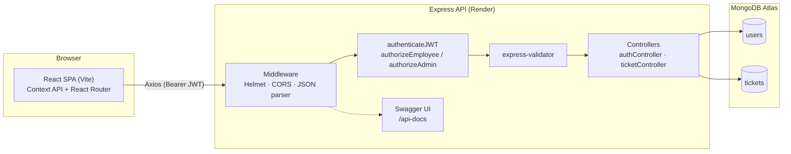

# DeskFlow — Internal IT Service Request Portal

DeskFlow is an internal helpdesk portal that lets employees file IT service tickets and lets IT administrators triage, filter, and resolve them. It is built as a realistic enterprise MERN application: a hardened Express/MongoDB API in front of a React single-page app, with role-based access control, full Swagger documentation, and deployment configs for Render + Vercel.

---

## Table of Contents

- [Overview](#overview)
- [Features](#features)
- [Architecture](#architecture)
- [Folder Structure](#folder-structure)
- [Installation](#installation)
- [Environment Variables](#environment-variables)
- [Demo Accounts](#demo-accounts)
- [API Documentation](#api-documentation)
- [Postman Collection](#postman-collection)
- [Deployment](#deployment)
- [Future Improvements](#future-improvements)

---

## Overview

| | |
|---|---|
| **Frontend** | React 18, React Router 6, Axios, Context API, CSS Modules (Vite) |
| **Backend** | Node.js, Express.js, Mongoose |
| **Database** | MongoDB |
| **Auth** | JWT (jsonwebtoken) + bcryptjs password hashing |
| **Docs** | Swagger UI / OpenAPI 3.0 at `/api-docs` |
| **Validation** | express-validator |
| **Security** | Helmet, CORS, centralized error handling |
| **Deployment** | Render (API) + Vercel (SPA) |

## Features

**Employees**
- Sign in with a username, password, and role selector
- File a new ticket (title, description, priority, category) with client- and server-side validation
- View only the tickets they personally created, with live status
- See at-a-glance stats: Open / In Progress / Resolved / Total

**Admins**
- View every ticket filed across the company
- Search tickets by title/description and filter by status or priority
- Update a ticket's status inline (Open → In Progress → Resolved) with an instant, optimistic UI update
- See company-wide stats

**Platform**
- JWT-based authentication with role-based route protection (`authenticateJWT`, `authorizeEmployee`, `authorizeAdmin`)
- Centralized Express error handler that normalizes Mongoose validation, duplicate-key, and cast errors
- Toast notifications + inline error alerts + loading states on the frontend
- Fully responsive layout (desktop, tablet, mobile)
- Complete OpenAPI 3.0 spec served through Swagger UI

## Architecture



**Request lifecycle:** every request passes through Helmet + CORS, then JSON parsing. Protected routes run `authenticateJWT` to verify the bearer token, followed by a role guard (`authorizeEmployee` / `authorizeAdmin`), then `express-validator` rules, then the controller, which talks to Mongoose models. Any thrown `ApiError` (or Mongoose error) is caught by the centralized error handler and returned as a consistent JSON error shape.

## Folder Structure

```
deskflow/
├── backend/
│   ├── src/
│   │   ├── config/          # MongoDB connection
│   │   ├── controllers/     # authController, ticketController
│   │   ├── middleware/      # auth guards, validators, error handler
│   │   ├── models/          # User, Ticket (Mongoose schemas)
│   │   ├── routes/          # authRoutes, ticketRoutes (+ Swagger JSDoc)
│   │   ├── docs/            # swagger.js (OpenAPI spec)
│   │   ├── utils/           # generateToken, asyncHandler, ApiError, seed
│   │   └── server.js
│   ├── .env.example
│   ├── package.json
│   └── render.yaml
├── frontend/
│   ├── src/
│   │   ├── pages/           # LoginPage, EmployeeDashboard, AdminDashboard
│   │   ├── components/      # Navbar, TicketForm, TicketList, TicketCard, ...
│   │   ├── context/         # AuthContext, ToastContext
│   │   ├── services/        # api.js, authService, ticketService
│   │   ├── hooks/           # useAuth, useTickets, useToast
│   │   ├── routes/          # AppRoutes.jsx
│   │   ├── styles/          # CSS Modules + design tokens
│   │   ├── App.jsx
│   │   └── main.jsx
│   ├── .env.example
│   ├── package.json
│   └── vercel.json
├── postman/
│   ├── DeskFlow.postman_collection.json
│   └── DeskFlow.postman_environment.json
└── README.md
```

## Installation

### Prerequisites
- Node.js 18+
- A MongoDB connection string (local `mongod` or MongoDB Atlas)

### Backend

```bash
cd backend
cp .env.example .env      # fill in MONGO_URI and JWT_SECRET
npm install
npm run dev                # nodemon, http://localhost:5000
```

Seed the two demo accounts (employee + admin):

```bash
node src/utils/seed.js
```

### Frontend

```bash
cd frontend
cp .env.example .env      # VITE_API_BASE_URL, defaults to http://localhost:5000/api
npm install
npm run dev                # http://localhost:5173
```

## Environment Variables

**backend/.env**

| Variable | Description | Example |
|---|---|---|
| `NODE_ENV` | Runtime environment | `development` |
| `PORT` | API port | `5000` |
| `MONGO_URI` | MongoDB connection string | `mongodb+srv://...` |
| `JWT_SECRET` | Secret used to sign JWTs | a long random string |
| `JWT_EXPIRES_IN` | Token lifetime | `8h` |
| `CLIENT_ORIGIN` | Allowed CORS origin(s), comma-separated | `http://localhost:5173` |

**frontend/.env**

| Variable | Description | Example |
|---|---|---|
| `VITE_API_BASE_URL` | Base URL of the backend API | `http://localhost:5000/api` |

## Demo Accounts

| Role | Username | Password |
|---|---|---|
| Employee | `employee1` | `Employee@123` |
| Admin | `admin1` | `Admin@123` |

Created by running `node src/utils/seed.js` in `backend/`.

## API Documentation

Once the backend is running, the full interactive OpenAPI 3.0 spec is available at:

```
http://localhost:5000/api-docs
```

Raw spec: `http://localhost:5000/api-docs.json`

| Method | Endpoint | Access | Description |
|---|---|---|---|
| `POST` | `/api/auth/login` | Public | Authenticate and receive a JWT |
| `GET` | `/api/auth/me` | Authenticated | Current user profile |
| `POST` | `/api/tickets` | Employee | Create a ticket |
| `GET` | `/api/tickets` | Employee / Admin | List tickets (own vs. all) |
| `GET` | `/api/tickets/stats` | Employee / Admin | Aggregate ticket counts |
| `GET` | `/api/tickets/:id` | Employee / Admin | Get a single ticket |
| `PUT` | `/api/tickets/:id` | Admin | Update ticket status |

## Postman Collection

Import `postman/DeskFlow.postman_collection.json` and `postman/DeskFlow.postman_environment.json` into Postman. The collection covers login (employee + admin), ticket creation, listing with filters, status updates, and a negative test proving employees receive `403` when attempting an admin-only action. Login requests automatically populate the `{{token}}` / `{{adminToken}}` environment variables.

## Deployment

**Backend → Render**
`backend/render.yaml` defines a Blueprint web service (`rootDir: backend`, `npm install` / `npm start`, health check at `/health`). Set `MONGO_URI`, `JWT_SECRET`, and `CLIENT_ORIGIN` as secret environment variables in the Render dashboard.

**Frontend → Vercel**
`frontend/vercel.json` configures the Vite build (`npm run build`, output `dist`) with an SPA rewrite so client-side routes resolve correctly. Set `VITE_API_BASE_URL` to the deployed Render URL (e.g. `https://deskflow-api.onrender.com/api`) in the Vercel project settings.

## Future Improvements

- Ticket comments/activity timeline for back-and-forth between employee and admin
- Email or in-app notifications when a ticket's status changes
- File attachments on tickets (screenshots, logs)
- Admin ability to reassign tickets to specific IT staff
- Refresh tokens + silent re-authentication instead of a hard logout on expiry
- Automated test suite (Jest + Supertest for the API, React Testing Library for the SPA)
- Audit log of all status changes for compliance reporting
n